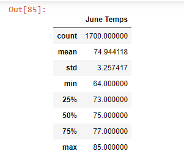
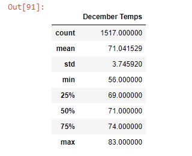

# **surfs_up**

## **Overview of the Analysis**

The purpose of this analysis is to provide a deep insight into some weather data obtained for a potential investor - W.Avy, in order to enable the investor make an investment decision into a surf board & ice cream shop business (Surf n' Shake) in Hawaii. Specifically, the investor wants us to analyze the temperature data for the months of June and December in Oahu, in order to determine if the surf and ice cream shop business will be sustainable year-round.

In order to provide this insight, my analysis was tailored to;

  1. Determine the summary statistics for temperature data for the months of June 
  2. Determine the summary statistics for temperature data for the months of December
  3. Create a written report for the statistical analysis

To generate these analysis, I utilized the following resources;

  - Data Source: hawaii.sqlite
  - Softwares: Python 3.7.6, Jupyter Notebook, Sqlite Database, SQLAlchemy, Flask
  

## **Result**
  
Following the statiscal analysis of the temperature data for June and December between the period of 2010 and 2017, the following are the 3 key differences / major points that were observed from the June and December data / statistics ;

 _- Mean (Average) Temperature: From a total temperature data size of 1,700 records, the average temperature in June for the period analyzed(2010-2017) was 74.94 while that of December (over a total data size of 1,517 records) was 71.04. This shows a marginal difference of about 5.2% between June and December._
 
  _- Minimum / Maximum Temperature: The lowest temperature recorded over the period under review was 64 for June and 56 for December (12.5% difference). On the other hand, the highest temperature recorded were 85 and 83 for June and December respectively (2.4% difference). From these we can deduce the while the highest temperature records for both periods (June & December) are relatively close, the lowest temperature records for both periods are slightly far apart._    
  
  _- Standard Deviation of the Temperature Dataset: The standard deviation of the June temperature data records was 3.257 while that of December was approximately 3.749. This effectively means that about 68% of the temperature records analyzed for June during the period under review, lie approximately between 71.68 and 78.20. In the same vein, for the December temperature records, we can also deduce that about 68% of the data lie approximatley between 67.29 and 74.79._ 

_The 2 images highlighted below show a detailed view of the summary statistics that were calculated for the June & December records between 2010 and 2017;_

## **Summary**

In summary and from the statistical review of the temperature data that were extracted for June and December during the period of 2010 to 2017, we observed that temperature records hovered between 64 and 85 degrees Farenheit (i.e. about 18 & 29 degrees celcius) in June (with about 68% of the June records also hovering between 71.68 & 78.20 degrees Ferenheit) while the temperature records for December hovered between 56 and 83 degrees Farenheit (i.e. about 14 & 28 degrees celcius) with about 68% of the December records also hovering between 67.29 and 74.79 degrees Farenheit. From this deduction, these historical temperature data effectively support the investment in the Surf Board n' Ice Cream shop business in Hawaii because a significant "chunk" of the temperature records for the city for the period under review (on the basis of June & December only) fairly favours surfing activities and the consumption of ice cream by surfers. These records show that the city has a relatively warm weather.

However, I will also recommend that the statistical temperature data highlighted above should be supplemented with data from the statistical analysis of precipitation records for the same period before a final investment decision is made by W.Aly. The combination of these 2 (temperature & precipitation) statistical data will effectively provide W.Aly with a robust view and consideration of 2 vital weather parameters before a decision is made on the investment.

Two (2) important queries that could help generate the statistical analysis of the precipitation records for the period of June & December (2010 to 2017) are hihlighted below;

 _1. The first query will be used to generate all precipitation data for June & December for the period under review (2010 to 2017)_
 
    _June_Precipitation_Result = session.query(Measurement.date, Measurement.prcp).filter(extract('month', Measurement.date)==6).all()
     print(June_Precipitation_Result)
    _December_Precipitation_Result = session.query(Measurement.date, Measurement.prcp).filter(extract('month', Measurement.date)==12).all()
     print(December_Precipitation_Result)

 _2. The second query will be used to first convert the data generated in query 1 above to a dataframe and thereafter generate key statistical precipitation data for June & December, for the period under review (2010 to 2017)_
 
    _June_Precipitation_Result_df = pd.DataFrame(June_Precipitation_Result, columns=['date','June Precipitation'])
    _June_Precipitation_Result_df.describe()
    

    _December_Precipitation_Result_df = pd.DataFrame(December_Precipitation_Result, columns=['date','December Precipitation'])
    _December_Precipitation_Result_df.describe()
    
